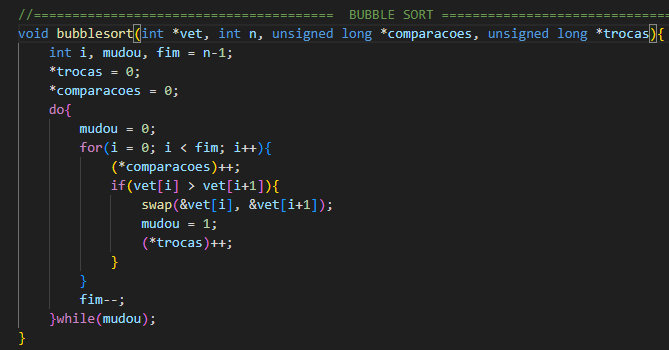
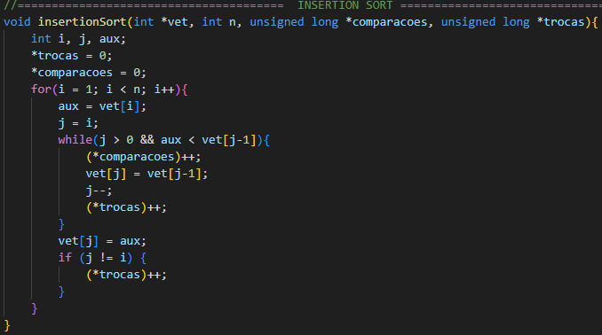
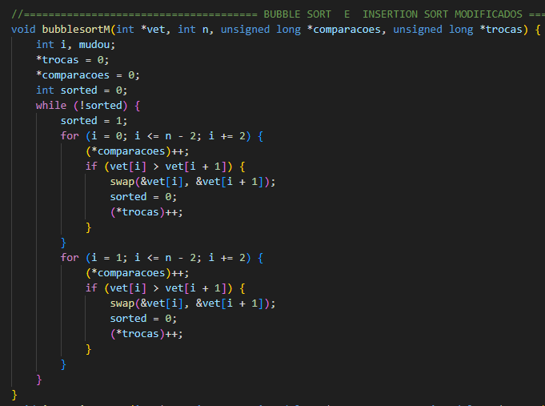
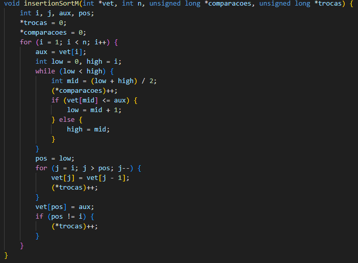

## An empirical and mathematical analysis of sorting algorithms based
compared between the original versions

# Efficiency Comparison between
Classical sorting algorithms and
its variations.

This project provides a comprehensive test suite to evaluate the performance of various sorting algorithms implemented in C. The following sorting algorithms are tested, made by Raphael Sousa Rabelo Rates and completed on 08/25/2024:

- **Selection Sort**
- **Quick Sort**
- **Insertion Sort**
- **Bubble Sort**
- **Merge Sort**

## Table of Contents

- [Project Overview](#project-overview)
- [Getting Started](#introduction)
  - [Prerequisites](#Trainment)
  - [Installation](#installation)
- [Usage](#usage)
  - [Running the Tests](#running-the-tests)
  - [Customizing Test Parameters](#customizing-test-parameters)
- [Sorting Algorithms Implemented](#sorting-algorithms-implemented)
  - [Selection Sort](#selection-sort)
  - [Quick Sort](#quick-sort)
  - [Insertion Sort](#insertion-sort)
  - [Bubble Sort](#bubble-sort)
  - [Merge Sort](#merge-sort)
- [Results](#results)
- [Contributing](#contributing)
- [License](#license)

## Project Overview

This work presents a test research between two sorting algorithms
classics, *bubbleSort* and *InsectionSort* and their variations modified by the
OpenAI **ChatGPT**. Choosing a variation generated by ChatGPT, we tested the metrics
of the generated function with the original function and compare the results to measure how
efficient is the modified implementation compared to the classical algorithm.

## Introduction

  After my sorting algorithms class in the *Algorithm Laboratory
and Data Structure*, The teacher of the subject, Paola Rodrigues de Godoy Accioly,
presented to his students, myself being one of them, a project to test such sorting algorithms
presented and select some of them to ask AI ChatGPT to make such
more efficient code. After selecting the generated result, we compare the metrics of the
respective functions to see the performance of the generated algorithm compared to the
original material
  The following classical algorithms presented for testing were total of 5,
It is possible to choose only 2 of them for the test.

  # Algorithms

| Algorithm      | Code       | Description                                      |
|----------------|------------|--------------------------------------------------|
| BubbleSort     | Iterative  | Move largest elements to the end of the vector in multiple passes.|
| InsertionSort  | Iterative  | Insert the elements in their appropriate positions in an already ordered list.|
| SelectionSort  | Iterative  | Repeatedly selects an element and places it in the correct position in the list.|
| MergeSort      | Recursive  | Divide the list into two, sort each division, and then combine in order.|
| QuickSort      | Recursive  | Separates the list into smaller parts based on a pivot and orders them recursively.|

## Theoretical Foundation

### Training

  During this phase, two sorting algorithms were selected to consult OpenAI's language model about potential efficiency improvements to the original code. After choosing the modified algorithms, a detailed analysis of the proposed modifications was conducted, including a justification for the choice. The selected algorithms were **Bubble Sort** and **Insertion Sort**.

### Bubble Sort

**Bubble Sort** is an algorithm that sorts by continuously swapping adjacent values in the array until each element is smaller than the next one, ensuring ascending order.

Its worst-case complexity is \(O(n^2)\), as, in the worst scenario, it must compare and potentially swap each element \(n\) times, comparing \(L[n]\) with \(L[n+1]\). In the best case, it only compares the values without performing any swaps.  

#### Insertion Sort

Although the algorithm's logic appears straightforward, its efficiency is significantly lower when compared to other classic sorting algorithms.  

Another algorithm used in this research is **InsertionSort**, a sorting algorithm that builds the final array by inserting one element at a time, traversing the elements of the vector until it finds the correct position for an element to be placed at a certain position in the array. Its complexity, like BubbleSort, is \(O(n²)\) because it needs to traverse all elements of the array n times to compare one element.

The InsertionSort is not an efficient algorithm compared to other sorting types like Merge or Quick, but it is quite useful for small inputs. Each algorithm underwent modifications using the chat tool, with the following variations being selected:

#### Bubble Sort Modified

The algorithm above was chosen for comparison for two reasons:

- **Absence of variations**: Among all the results provided by *ChatGPT*, almost all of them were simply rewrites of the same algorithm with only minor modifications that were not very relevant when tested through empirical analysis.
  
- **Array traversal logic**: The logic present in the algorithm demonstrates a comparison between odd and even elements, requiring fewer comparisons compared to the original algorithm. Upon further research, it was discovered that the algorithm generated by ChatGPT is a sorting algorithm based on BubbleSort called "Odd-Even Sort". This algorithm is essentially a version of BubbleSort, but with the even and odd elements in the array being compared with their respective elements in each group.

- **Mathematical analysis**: Knowing that BubbleSort has a time complexity of \(O(n²)\) and analyzing the worst-case scenario for the algorithm, we have:

Let:

- C1 = value change
- C2 = condition
- C3 = swap()
- C4 = initializing or declaring a variable
- n = number of elements in the array

The equation is:

$$
E_q = C1 + n \times 2 \left( C4 + C2 + n \times \left( C2 + C3 + 2 \times C1 \right) \right)
$$

Simplified, this becomes:

$$
E_q = C1 + n \times \left( 2C4 + 2C2 + nC2 + nC3 + n^2 C1 \right)
$$

Rewriting it:

$$
E_q = n \times \frac{1}{2} \times \left( 2C2 + 2C3 + 2C1 + \frac{C4}{n} + \frac{C2}{n} \right) + C1
$$

Given that C1, C2, C3, and C4 are constants (which are ignored in Big-O notation) and the greatest factor of change in the equation is \( n^2 \), considering \( \beta = 2C2 + 2C3 + 2C1 + \frac{C4}{n} + \frac{C2}{n} \), and a random constant of 4, we can say that:

$$
E_q = n^2 \times \beta + C1 \Rightarrow n^2 \times \beta + C1 \leq 4n^2
$$

Therefore, since the equation \( E_q \) is less than or equal to a constant multiplied by \( n^2 \), the worst-case complexity of the modified algorithm is \( O(n^2) \), which is the same as the original BubbleSort.

**Note:** In the equation, the comparison and swap pointers are disregarded to represent a scenario with pure sorting, without the counting of metrics.

#### Insertion Sort Modified 

The algorithm above was chosen for comparison for two reasons:
- **Absence of variations**: Among all the results given by ChatGPT, almost all of them simply rewrote the same algorithm with only a few modifications that were not very relevant when tested in empirical analyses.
- **Binary Search**: The modification to use binary search instead of iterating through the entire array, optimizing both time and the number of comparisons between elements.
- **Mathematical Analysis**: Knowing that InsertionSort has a time complexity of \( O(n^2) \), we perform an analysis of the modified algorithm in the worst case, as follows:

### Mathematical Analysis of the Modified Algorithm

Let:
- **C1** = value change
- **C2** = condition
- **C3** = swap()
- **C4** = variable initialization or declaration
- **n** = number of elements in the array

The equation for the modified algorithm is as follows:

\[
E_q = 4C1 + n \left(3C4 + C2 + n \times \left(\frac{C2 + C4}{n^2}\right) + C4 + n(C4) + C4 \right)
\]

\[
= 4C1 + n \times \left(5C4 + C2 + \log(n) + nC4 \right)
\]

\[
= n^2 C4 + n \log(n) + n C2 + n5C4 + 4C1
\]

\[
= n^2 \times \left( C4 + \frac{\log(n)}{n} + \frac{C2}{n} + \frac{5C4}{n} + \frac{4C1}{n^2} \right)
\]

Where **C1**, **C2**, **C3**, and **C4** are constants and are disregarded in Big O notation. The dominant factor in the equation is \( n^2 \). Considering \( \beta = \left( C4 + \frac{\log(n)}{n} + \frac{C2}{n} + \frac{5C4}{n} + \frac{4C1}{n^2} \right) \) and a constant \( \alpha = 3 \), we can conclude:

\[
E_q = n^2 \times \beta + C1 \Rightarrow n^2 \times \beta + C1 \leq 3n^2
\]

Thus, since the equation \( E_q \) is less than or equal to a constant multiplied by \( n^2 \), the worst-case complexity of the modified algorithm is \( O(n^2) \), which is the same as the original **BubbleSort** algorithm. This holds true even though the complexity of the comparisons is \( O(\log(n)) \) in comparison to the original algorithm, which is \( O(n^2) \).

**Note:** In the equation, the pointers for comparisons and swaps are disregarded to represent a scenario with pure sorting and without counting metrics.
